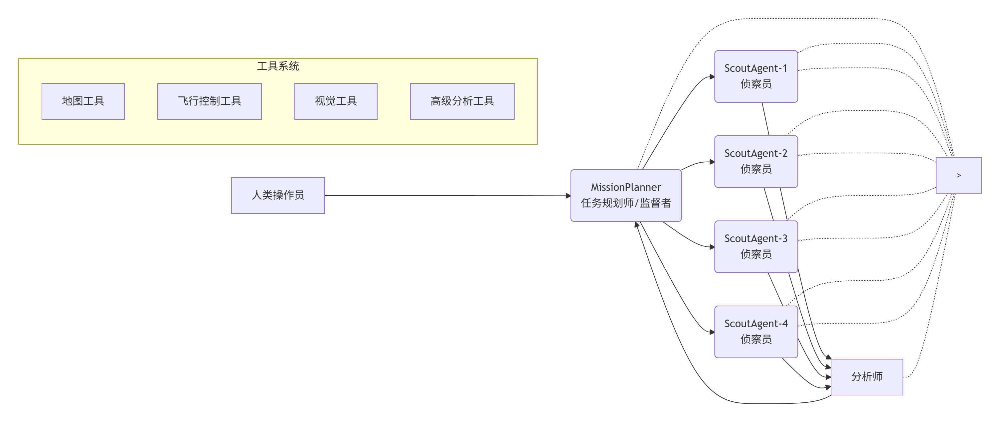

# 6.2 多Agent 无人机任务设计

我们设计了一个无人机最常用的应用场景 “协同搜索与勘察任务”

设计一个用于在广阔林区执行搜救任务的多智能体系统。

# 想定设计

# 智能体角色与职责（借鉴ChatDev的角色扮演设计思想）

## 任务规划师 (MissionPlanner) - 监督者
- **职责**：接收人类操作员下达的搜索区域和任务目标。
- **工具**：
  - 使用一个“地图工具”（一个可以进行地理空间计算的函数）将整个搜索区域划分为若干个独立的扇区。
- **行动**：
  - 实例化多个“侦察员”智能体，为每个智能体分配一个扇区。
  - 维护一张标明已搜索和未搜索区域的主地图，并作为所有通信的中心枢纽。

## 侦察员 (ScoutAgent) - 工作者（每个UAV对应一个）
- **职责**：接收来自“任务规划师”的扇区分配。
- **工具**：
  - 使用飞行控制工具（如`fly_to_position`）和“视觉工具”（一个代表计算机视觉模型的函数，用于分析图像）。
- **行动**：
  - 在自己的负责扇区内规划高效的“之”字形飞行路径并执行。
  - 持续使用“视觉工具”分析实时视频流，寻找失踪人员的迹象（如特定颜色的衣物、篝火等）。

## 分析师 (AnalystAgent) - 专家
- **职责**：对“侦察员”上报的低置信度发现进行深入分析。
- **工具**：
  - 拥有更强大的分析工具，例如图像增强算法、目标识别模型库等。
- **行动**：
  - 当某个“侦察员”报告了一个不确定的发现时，“任务规划师”会将相关的图像和坐标数据路由给“分析师”。
  - “分析师”进行研判后，向“任务规划师”提出建议，例如“确认是误报”或“建议派遣无人机进行更近距离的悬停观察”。



## 交互流程

### 1. 任务启动
- **描述**：人类操作员向MissionPlanner下达指令：“在X国家公园搜索一名身穿红色夹克的失踪徒步者。”

### 2. 任务分解与分配
- **描述**：MissionPlanner调用地图工具，将公园划分为4个扇区，并实例化4个ScoutAgent，分别命名为Scout-1至Scout-4，并向它们发送指令：“搜索你被分配的扇区”。

### 3. 并行执行
- **描述**：4个ScoutAgent同时开始在各自的扇区内执行搜索任务，它们周期性地向MissionPlanner报告自己的位置和状态（“Scout-2正在搜索扇区B，已完成30%”）。

### 4. 发现与上报
- **描述**：Scout-3的视觉工具检测到一个红色物体，但置信度较低。它向MissionPlanner发送消息：“在坐标(x, y, z)处发现疑似目标，置信度60%，附上图像。”

### 5. 专家介入（控制权移交）
- **描述**：MissionPlanner接收到该消息，决定将此发现移交给专家处理。它向AnalystAgent发送消息：“请分析来自Scout-3的图像，坐标(x, y, z)。”

### 6. 分析与反馈
- **描述**：AnalystAgent分析图像后，回复MissionPlanner：“分析结果表明，该物体有85%的可能是人造织物。建议Scout-3飞往该坐标进行低空悬停确认。”

### 7. 指令下达
- **描述**：MissionPlanner采纳建议，向Scout-3下达新指令：“飞往坐标(x, y, z)，降低高度至10米并悬停，传输实时高清视频。”

### 8. 任务完成
- **描述**：Scout-3确认目标后，MissionPlanner向人类操作员报告，并指挥其他ScoutAgent继续搜索剩余区域。

> 这个案例清晰地展示了监督者-工作者模式如何与专家智能体的控制权移交相结合，构成一个高效、智能的协同系统。


## airsim环境设置

本节是本章的顶点，理论将在这里付诸实践。我们的目标是提供一个详尽的、学生可以复现的、手把手的教程。我们将使用LangGraph和AirSim，实现一个由两架无人机组成的“监督者-侦察员”系统。


## 配置 AirSim

首先，我们需要配置 AirSim 模拟器以生成一个多无人机环境。这通过修改 AirSim 的 `settings.json` 文件来完成。该文件通常位于您的 `文档/AirSim` 目录下。

以下是一个完整的 JSON 配置片段，它将在模拟开始时生成两架名为 `"Drone1"` 和 `"Drone2"` 的多旋翼无人机，并为它们设置不同的初始位置。

```json
{
  "SettingsVersion": 1.2,
  "SimMode": "Multirotor",
  "Vehicles": {
    "Drone1": {
      "VehicleType": "SimpleFlight",
      "X": 0,
      "Y": 0,
      "Z": 0,
      "Yaw": 0
    },
    "Drone2": {
      "VehicleType": "SimpleFlight",
      "X": 5,
      "Y": 0,
      "Z": 0,
      "Yaw": 0
    }
  }
}

```

将此内容保存到settings.json后，启动您的AirSim环境。您应该能看到两架无人机出现在场景中。

## 连接与验证
接下来，我们用一个简单的Python脚本来验证我们的设置是否成功。这个脚本将连接到模拟器，并使用listVehicles() API来确认两架无人机都已成功生成并可以被程序访问。


```python
import sys
sys.path.append('../external-libraries')

import airsim

# 连接到AirSim模拟器
client = airsim.MultirotorClient()
client.confirmConnection()

# 列出所有可用的无人机名称
vehicle_names = client.listVehicles()
print(f"成功连接到AirSim，发现以下无人机: {vehicle_names}")

# 预期的输出: 成功连接到AirSim，发现以下无人机:
```

    Connected!
    Client Ver:1 (Min Req: 1), Server Ver:1 (Min Req: 1)
    
    成功连接到AirSim，发现以下无人机: ['Drone1', 'Drone2']
    

如果脚本成功运行并打印出无人机列表，说明您的多无人机环境已经准备就绪。


```python

```
